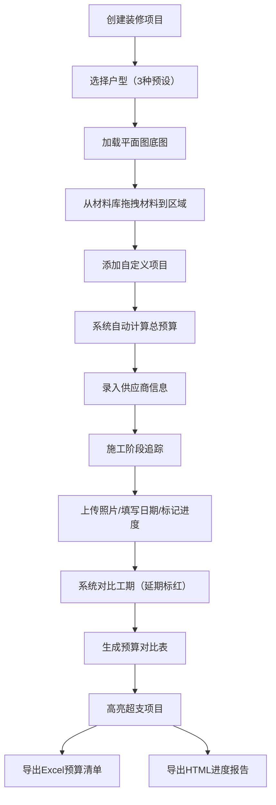

## 1. 产品概述

装修公司预算与施工进度看板是一款面向装修公司和业主的全流程管理工具，通过可视化的户型平面图、拖拽式材料选择、智能预算计算和施工进度追踪，实现装修项目从预算规划到施工交付的全生命周期管理。

- 核心目标：解决装修过程中预算不透明、进度难追踪、材料管理混乱的痛点
- 目标用户：装修公司项目经理、预算员、业主
- 产品价值：提升装修项目管理效率，降低预算超支风险，实现施工进度可视化

## 2. 核心功能

### 2.1 用户角色
| 角色 | 注册方式 | 核心权限 |
|------|----------|----------|
| 项目经理 | 无需注册，直接使用 | 创建项目、管理预算、追踪进度、导出报告 |
| 预算员 | 无需注册，直接使用 | 材料选择、预算计算、供应商管理 |
| 业主 | 无需注册，直接使用 | 查看预算、查看进度、确认阶段完成 |

### 2.2 功能模块
1. **项目管理页**：户型选择、平面图展示、项目信息管理
2. **材料预算页**：材料库、拖拽分配、自动计价、自定义项目
3. **施工进度页**：5阶段追踪、照片上传、工期对比、完成度标记
4. **对比分析页**：预算vs实际支出对比表、超支高亮
5. **供应商管理页**：材料供应商信息管理、联系方式记录
6. **导出中心**：Excel预算清单导出、HTML进度报告导出

### 2.3 页面详情
| 页面名称 | 模块名称 | 功能描述 |
|----------|----------|----------|
| 项目管理页 | 户型选择器 | 3种预设户型（一居室、两居室、三居室），每种含平面图底图 |
| 项目管理页 | 项目信息卡片 | 项目名称、业主信息、建筑面积、开工日期 |
| 材料预算页 | 材料库面板 | 5大类材料（地板、瓷砖、油漆、卫浴、橱柜），每类3-5种规格，含单价 |
| 材料预算页 | 平面图拖拽区 | 将材料拖拽到对应区域（客厅、卧室、厨房、卫生间） |
| 材料预算页 | 预算计算面板 | 自动计算材料费、人工费（建筑面积×单价）、总预算 |
| 材料预算页 | 自定义项目 | 支持添加拆墙、垃圾清运等自定义项目，手动输入价格 |
| 施工进度页 | 阶段时间线 | 水电、泥瓦、木工、油漆、安装5个阶段 |
| 施工进度页 | 进度卡片 | 计划工期、实际开始/结束日期、完成百分比、延期标红 |
| 施工进度页 | 照片上传 | 每个阶段最多上传3张现场照片 |
| 对比分析页 | 预算对比表 | 预算金额、实际支出、差额、超支项目高亮显示 |
| 供应商管理页 | 供应商列表 | 材料类别、供应商名称、联系人、电话、地址 |
| 导出中心 | 导出功能 | Excel预算清单导出、HTML施工进度报告导出 |

## 3. 核心流程

用户创建装修项目 → 选择户型加载平面图 → 从材料库拖拽材料到对应区域 → 添加自定义项目 → 系统自动计算总预算 → 录入供应商信息 → 施工阶段追踪（上传照片、填写日期、标记进度） → 系统对比计划与实际工期 → 生成预算对比表（超支高亮） → 导出预算清单和进度报告

## 4. 用户界面设计

### 4.1 设计风格
- **主色调**：深蓝色 #1e3a5f（专业、稳重），搭配暖橙色 #ff7b29（活力、警示）
- **辅助色**：浅灰蓝 #f0f4f8（背景），深灰 #2d3748（文字），绿色 #38a169（完成），红色 #e53e3e（超支/延期）
- **按钮风格**：圆角矩形，4px圆角，悬停时有微缩放和阴影效果
- **字体**：标题使用 "Noto Sans SC" 粗体，正文使用 "Noto Sans SC" 常规体
- **布局风格**：左右分栏布局，左侧导航+右侧内容区，卡片式模块设计
- **图标风格**：线性图标，简洁现代，与装修主题匹配

### 4.2 页面设计概述
| 页面名称 | 模块名称 | UI元素 |
|----------|----------|--------|
| 项目管理页 | 户型选择器 | 卡片式户型预览，hover放大效果，选中高亮边框 |
| 项目管理页 | 平面图展示 | SVG绘制的可交互平面图，区域可高亮 |
| 材料预算页 | 材料库面板 | 折叠式分类面板，材料卡片显示缩略图、名称、单价 |
| 材料预算页 | 拖拽交互 | 拖拽时半透明效果，放置区域高亮提示 |
| 材料预算页 | 预算面板 | 固定在右侧，实时更新，分项展开/收起 |
| 施工进度页 | 阶段时间线 | 垂直时间线，阶段节点带状态指示（未开始/进行中/已完成/延期） |
| 施工进度页 | 照片预览 | 缩略图网格，点击放大查看 |
| 对比分析页 | 对比表格 | 斑马纹行，超支行红色背景高亮 |
| 供应商管理页 | 供应商卡片 | 网格布局，显示关键信息，支持编辑 |
| 导出中心 | 导出按钮 | 大按钮，带图标，明确的文件格式标识 |

### 4.3 响应式
- **设计原则**：桌面端优先，自适应平板和移动端
- **断点**：≥1200px（桌面），768-1199px（平板），<768px（手机）
- **移动端适配**：左侧导航转为底部Tab栏，分栏布局转为垂直堆叠
- **触摸优化**：拖拽支持触摸事件，按钮最小44×44px触摸区域

### 4.4 动画与交互
- 页面加载：模块淡入+向上滑动，错开延迟
- 拖拽操作：材料卡片半透明跟随，目标区域边框闪烁
- 数据更新：数字滚动动画，进度条平滑过渡
- 状态变化：完成状态绿色扩散动画，延期状态红色脉冲提示
- 悬停效果：卡片微上浮，阴影加深，按钮背景色渐变
