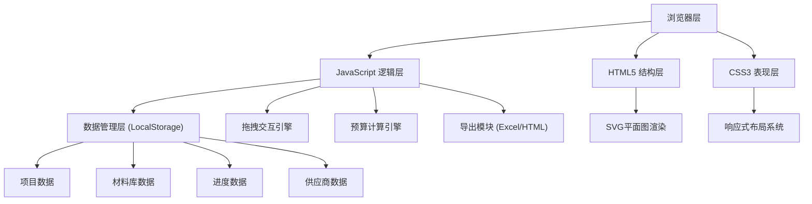
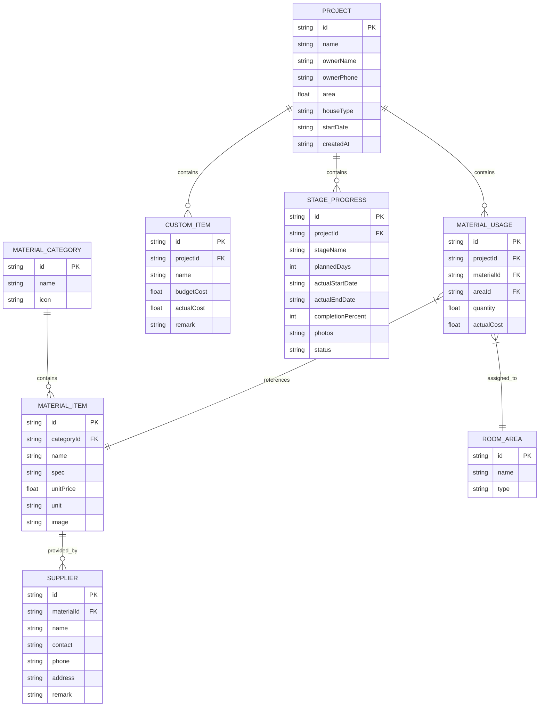

## 1. 架构设计

本项目采用纯前端架构，无需后端服务，所有数据存储在浏览器本地（LocalStorage），通过原生JavaScript实现交互逻辑。

## 2. 技术描述

- **前端**：原生 HTML5 + CSS3 + JavaScript (ES6+)
- **初始化工具**：无需构建工具，直接打开 index.html 运行
- **后端**：无后端，纯前端实现
- **数据库**：浏览器 LocalStorage 存储，JSON 格式数据
- **第三方库**：
  - SheetJS (xlsx.js)：用于 Excel 导出
  - 无其他依赖，所有功能原生实现

## 3. 页面结构

| 文件路径 | 用途 |
|----------|------|
| /index.html | 主页面，包含所有视图和模态框 |
| /css/style.css | 主样式文件，包含所有UI样式 |
| /js/data.js | 预设数据（户型、材料库、阶段配置） |
| /js/storage.js | LocalStorage 数据管理封装 |
| /js/drag.js | 拖拽交互引擎 |
| /js/calculator.js | 预算计算引擎 |
| /js/export.js | 导出模块（Excel/HTML） |
| /js/app.js | 主应用逻辑，协调各模块 |

## 4. 数据模型

### 4.1 数据模型定义

### 4.2 数据初始化

预设数据在 `js/data.js` 中定义：

1. **户型数据**（3种）：
   - 一居室：50㎡，含客厅、卧室、厨房、卫生间
   - 两居室：80㎡，含客厅、主卧、次卧、厨房、卫生间
   - 三居室：120㎡，含客厅、主卧、次卧、书房、厨房、卫生间×2

2. **材料库数据**（5大类，每类3-5种）：
   - 地板：实木地板、复合地板、强化地板
   - 瓷砖：抛光砖、仿古砖、马赛克、瓷片
   - 油漆：乳胶漆、木器漆、防水涂料
   - 卫浴：马桶、洗手盆、淋浴花洒、浴缸
   - 橱柜：整体橱柜、吊柜、地柜

3. **施工阶段数据**（5个阶段）：
   - 水电阶段：计划15天
   - 泥瓦阶段：计划20天
   - 木工阶段：计划25天
   - 油漆阶段：计划15天
   - 安装阶段：计划10天

## 5. 核心模块说明

### 5.1 拖拽交互引擎 (drag.js)
- 使用 HTML5 Drag and Drop API
- 支持材料卡片从材料库拖拽到平面图区域
- 拖拽时显示半透明预览，目标区域高亮
- 触摸设备支持 Touch API 模拟拖拽

### 5.2 预算计算引擎 (calculator.js)
- 材料费：Σ(材料单价 × 使用数量)
- 人工费：建筑面积 × 人工单价（预设300元/㎡）
- 自定义项目费：Σ(自定义项目费用)
- 总预算：材料费 + 人工费 + 自定义项目费
- 实际支出：Σ(材料实际费用 + 自定义项目实际费用)
- 差额：实际支出 - 预算金额

### 5.3 导出模块 (export.js)
- **Excel导出**：使用 SheetJS 生成 .xlsx 文件，包含材料清单、自定义项目、汇总表
- **HTML导出**：生成完整的HTML进度报告，包含所有阶段信息、照片、工期对比

### 5.4 平面图渲染
- 使用内联 SVG 绘制户型平面图
- 各区域（客厅、卧室等）可独立高亮和接收拖拽
- 拖拽放置后在区域内显示材料标签

### 5.5 照片管理
- 使用 FileReader API 读取本地图片
- 转换为 Base64 存储在 LocalStorage
- 每个阶段最多存储3张照片
- 支持点击放大预览

## 6. 关键技术实现

1. **LocalStorage 封装**：统一的 CRUD 接口，数据自动序列化/反序列化
2. **事件委托**：使用事件委托处理动态生成元素的事件
3. **模块模式**：各功能模块独立封装，通过全局 App 对象协调
4. **CSS 变量**：使用 CSS 自定义属性实现主题色统一管理
5. **动画实现**：优先使用 CSS Transition/Animation，性能更佳
6. **图片预览**：使用模态框展示大图，支持键盘 ESC 关闭
